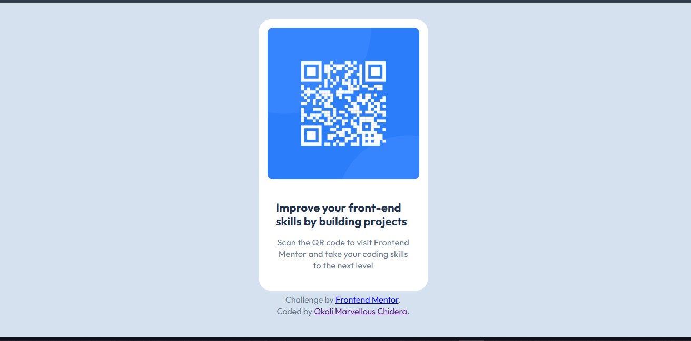

# Frontend Mentor - QR code component solution

This is a solution to the [QR code component challenge on Frontend Mentor](https://www.frontendmentor.io/challenges/qr-code-component-iux_sIO_H). Frontend Mentor challenges help you improve your coding skills by building realistic projects. 

## Table of contents

- [Overview](#overview)
  - [Screenshot](#screenshot)
  - [Links](#links)
- [My process](#my-process)
  - [Built with](#built-with)
  - [What I learned](#what-i-learned)
  - [Continued development](#continued-development)
  - [Useful resources](#useful-resources)
  - [AI Collaboration](#ai-collaboration)
- [Author](#author)
- [Acknowledgments](#acknowledgments)

## Overview

### Screenshot




### Links

- Live Site URL: [ Live site URL here](https://your-live-site-url.com)

## My process

### Built with

- Semantic HTML5 markup
- CSS custom properties
- Flexbox
- Mobile-first workflow
styles

### What I learned
Building this project has taught me a lot about the use of modern CSS properties. Things I never new they where possible. A more better way to get better results.

One of the things I learnt was the use of Modern CSS logical properties.
``` css
/* inline-size
block-size
border-inline
margin-inline  */
```
I also learnt that beyond the scope of this project the use of CSS logical properties helps in many ways like developing of websites that automatically changes its writing formats when the language is changed; e.g Arabic  

### Continued development

I sincerely believe that CSS is changing rapidly just the same way programming languages evolve. I look forward to continue to learn and research more about these modern ways to getting better results that way I am becoming good at writing better code.

### Useful resources

- [MDN - CSS logical properties](https://developer.mozilla.org/en-US/docs/Web/CSS/Guides/Logical_properties_and_values) - This helped me in studying more about CSS logical properties and also how they can be used to doing better things.


### AI Collaboration
The use of AI tools in building this project cannot be overlooked. As it had helped me to know the underlining reasons for the choices I made why working on the project and also better ways to write them. 

- I used Gemini in Chrome
- I had used it in debugging some issues I encountered in my developing of the project, like why the picture is not centering and how to solve it. 
- I tired my best not to let it write any of my code, it was my go to research platform to knowing how to resolve a problem I encountered and explaining in depth the codes it had suggested.


## Author

- Profile-card - [My social media links](https://marve26020.github.io/Profile_Card/)
- Frontend Mentor - [@marve26020](https://www.frontendmentor.io/profile/marve26020)


## Acknowledgments
I sincerely want to thank [Frontend Mentor](https://www.frontendmentor.io) platform for this opportunity to mark this project my first project since my lessons began and also providing me with professional tools like the figma design and other useful items. 